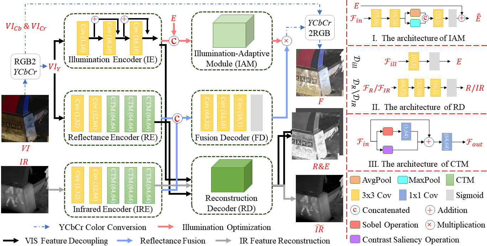

# RDMFuse
Codes of ***A Retinex Decomposition Model-Based Deep Framework for Infrared and Visible Image Fusion. (JSTSP)***
- Xue Wang, Wenhua Qian, Zheng Guan, Jinde Cao, RunZhuo Ma, Chengchao Wang

# Abstract
Infrared and visible image fusion (IVIF) aims to integrate complementary information between sensors and generate information-rich high-quality images. However, current methods mainly concentrate on the fusion of the source features from the sensors, ignoring the feature information mismatch caused by the property of the sensors, which results in redundant or even invalid information.   To tackle the above challenges, this paper developed an end-to-end model based on the Retinex Decomposition Model (RDM), called RDMFuse, which utilizes a hierarchical feature process to alleviate the fusion performance degradation caused by the feature-level mismatch. Specifically, as infrared images only provide an overview of the intrinsic properties of the scene, we first use RDM to decouple visible images into a reflectance component containing intrinsic properties and an illumination component containing illumination information. Then, the contrast texture module (CTM) and the intrinsic fusion function are designed for the property of the intrinsic feature, which complements each other to aggregate the intrinsic information of the source images at a smaller cost and brings the fused image more comprehensive scene information. Besides, the illumination-adaptive module implements illumination component optimization in a self-supervised way to make the fused image with an appropriate intensity distribution. It is worth noting that this mechanism implicitly improves the entropy quality of the image to improve the image degradation problem caused by environmental factors, especially in the case of a dark environment. Numerous experiments have demonstrated the effectiveness and robustness of the RDMFuse and the superiority of generalization in high-level vision tasks due to the improved discriminability of the fused image to the captured scene.

# :triangular_flag_on_post: Testing
If you want to infer with our EMMA and obtain the fusion results in our paper, please run ```test.py```.
Then, the fused results will be saved in the ```'./Fused image/'``` folder.

# :triangular_flag_on_post: Training
You can change your own data address in ```dataset.py``` and use ```train.py``` to retrain the method.

# :triangular_flag_on_post: Illustration of our RDMFuse model


# :triangular_flag_on_post: Citation
```bibtex
@article{wangretinex,
  title={A Retinex Decomposition Model-Based Deep Framework for Infrared and Visible Image Fusion},
  author={Wang, Xue and Qian, Wenhua and Guan, Zheng and Cao, Jinde and others}
}
```

## 🚀 Related Work
- Xue Wang, Zheng Guan, Wenhua Qian, Jinde Cao, Shu Liang, Jin Yan. *CS²Fusion: Contrastive learning for Self-Supervised infrared and visible image fusion by estimating feature compensation map*. **INF FUS 2024**, [https://www.sciencedirect.com/science/article/abs/pii/S156625352300355X](https://www.sciencedirect.com/science/article/abs/pii/S156625352300355X)
- Xue Wang, Zheng Guan, Wenhua Qian, Jinde Cao, Chengchao Wang, Runzhuo Ma. *STFuse: Infrared and Visible Image Fusion via Semisupervised Transfer Learning*. **TNNLS 2024**, [https://ieeexplore.ieee.org/abstract/document/10312808](https://ieeexplore.ieee.org/abstract/document/10312808)
- Xue Wang, Zheng Guan, Wenhua Qian, Jinde Cao, Chengchao Wang, Chao Yang.  *Contrast saliency information guided infrared and visible image fusion*. **TCI 2023**, [https://ieeexplore.ieee.org/abstract/document/10223277](https://ieeexplore.ieee.org/abstract/document/10223277)
- Xue Wang, Zheng Guan, Shishuang Yu, Jinde Cao, Ya Li. *Infrared and visible image fusion via decoupling network*. **TIM 2022**, [https://ieeexplore.ieee.org/abstract/document/9945905](https://ieeexplore.ieee.org/abstract/document/9945905)
- Zheng Guan, Xue Wang, Rencan Nie, Shishuang Yu, Chengchao Wang. *NCDCN: multi-focus image fusion via nest connection and dilated convolution network*. **Appl Intel 2022**, [https://link.springer.com/article/10.1007/s10489-022-03194-z](https://link.springer.com/article/10.1007/s10489-022-03194-z)
